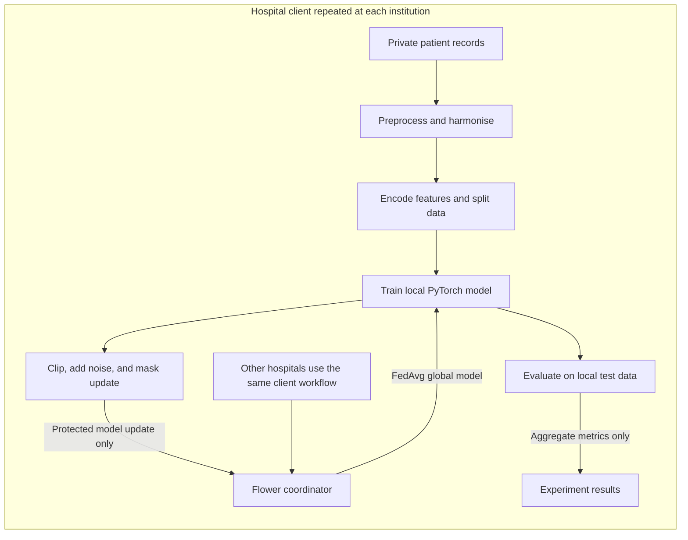
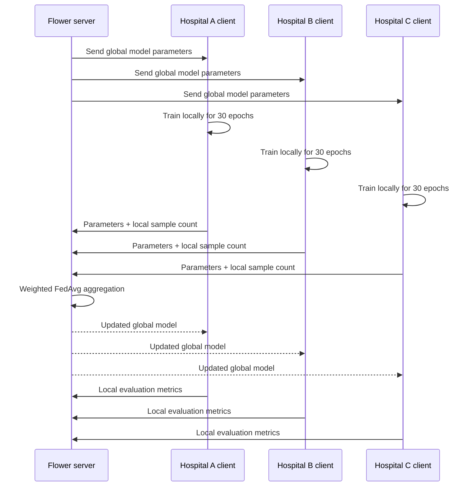
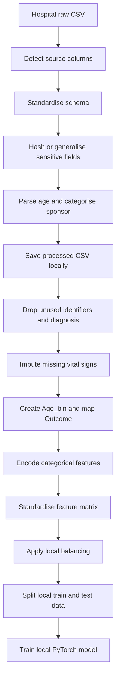
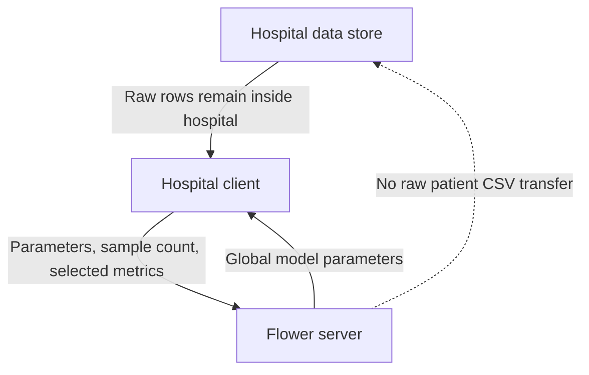
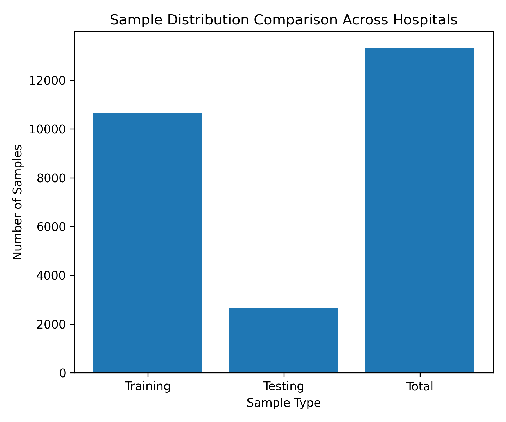

# Mwakatobe Federated Learning and Privacy-Preserving Healthcare Architecture

## Executive Summary

Mwakatobe is a multi-institutional healthcare machine-learning prototype in which Hospital A, Hospital B, and Hospital C train a shared predictive model without placing their patient-level CSV records on a central server. The system uses Flower to coordinate federated learning, PyTorch for local neural-network training, local preprocessing and anonymisation, weighted Federated Averaging (FedAvg), and experimental client-side parameter perturbation and masking.

The architecture is best described as a **central-coordinator federated learning system with privacy-oriented controls**. Patient rows remain within each hospital's local data boundary during training. The coordinating server distributes the current global model and receives client model parameters, sample counts, and evaluation results. The current implementation does not yet provide a formal differential-privacy guarantee or cryptographic secure aggregation; those should be treated as planned hardening activities rather than completed security properties.

## 1. System Objectives and Boundaries

### Objectives

The proposed system aims to:

- Enable several hospitals to learn a common clinical outcome model.
- Avoid centralising raw patient records.
- Harmonise differently structured hospital datasets.
- Reduce exposure of direct identifiers and detailed clinical fields.
- Address local class imbalance.
- Measure performance separately for each hospital.
- Provide a foundation for fairness and privacy analysis.

### Trust boundaries

There are three important boundaries:

1. **Hospital boundary:** each institution owns and processes its local patient data.
2. **Communication boundary:** model parameters move between clients and the Flower server.
3. **Coordinator boundary:** the server coordinates rounds and aggregates updates but is not assumed to have access to raw patient rows.

A production deployment would also need authenticated, encrypted client-server communication, access control, audit logs, secret management, and an explicit threat model. The current local configuration uses `127.0.0.1:9090`, which is suitable for experimentation but not a distributed clinical deployment.

## 2. High-Level Architecture



This is a representative view: every participating hospital uses the same client workflow shown inside the hospital boundary. The coordinator receives protected model updates and selected aggregate metrics, never the private patient records. `K` represents the total number of participating institutions.

**Plain-text flow:** Private patient records -> local preprocessing -> local training -> update protection -> Flower/FedAvg coordinator -> global model returned to the hospital. Raw patient rows remain inside each hospital.

The architecture has two complementary pipelines:

- **Data pipeline:** raw hospital files are transformed into cleaned, harmonised local datasets.
- **Model pipeline:** local clients train from the current global model, transform outgoing parameters, and participate in server aggregation.

## 3. End-to-End Execution Flow

The entry point is [main.py](main.py). Its execution sequence is:

1. Disable CUDA for the experiment and force CPU execution.
2. Preprocess raw hospital files with `preprocess_all_data()`.
3. Clean and harmonise the processed files with `clean_all_data()`.
4. Discover the shared outcome-class mapping.
5. Start a Flower server subprocess.
6. Start one client thread for each cleaned hospital CSV.
7. Run the configured federated rounds.
8. Wait for all clients to finish.
9. Generate per-run results, figures, and summaries.
10. Stop the server and begin the next experiment run.

The main experiment runner repeats this process for `NUM_RUNS` runs. The generated outputs are placed under `results/`.

### Federated round sequence



For client $k$ with $n_k$ training examples, the intended FedAvg update is:

$$
w_{t+1} = \sum_{k=1}^{K}\frac{n_k}{\sum_{j=1}^{K}n_j}w_{t+1}^{(k)}
$$

where $w_{t+1}^{(k)}$ is the locally trained parameter set returned by client $k$.

## 4. Data Engineering and Anonymisation

### 4.1 Raw-to-cleaned transformation

The preprocessing layer in [client/data_utils.py](client/data_utils.py) detects and standardises source columns, parses ages, categorises sponsors, generalises clinical fields, hashes selected values, and removes duplicate records. The cleaning layer in [client/clean_app.py](client/clean_app.py) removes direct identity and diagnosis columns, imputes vital signs, creates age bins, and maps outcomes.

The resulting feature set used by clients includes:

- `Age`
- `Sponsor`
- `Region`
- `Pulse`
- `Resp`
- `Temp`
- `Sys`
- `Dia`
- `Procedures`
- `Medications`
- `Age_bin`

The current source inventory contains 15,208 raw records and 13,329 records after identifier-based deduplication: Hospital A contributes 10,569 records, Hospital B 990, and Hospital C 1,770. The final record contribution is therefore 79.29%, 7.43%, and 13.28%, respectively. The values 16,212 and 14,818 mentioned in an earlier manuscript draft do not occur in the current repository and cannot be verified against this data version.

### 4.2 Data-quality and missingness heterogeneity

The raw hospital exports have different schemas and different levels of feature availability. Hospitals A and B contain 17 source columns, including five vital-sign fields, while Hospital C contains 12 source columns and does not provide those vital-sign fields. The following feature-level missingness results were calculated directly from the raw CSV files. Blank values and explicit missing-value markers (`NA`, `None`, `Unknown`, `Not recorded`, and `-`) are counted as missing.

| Hospital | Records | Source columns | Overall missing cells | Features with missing values |
|---|---:|---:|---:|---:|
| Hospital A | 12,000 | 17 | 5.76% | Pulse, Resp, Temp, Sys, Dia, Diagnoses, Procedures, Medications |
| Hospital B | 1,379 | 17 | 2.59% | Pulse, Resp, Temp, Sys, Dia, Diagnoses, Procedures, Outcome |
| Hospital C | 1,829 | 12 | 7.95% | Ordered Tests, Procedures, Outcome |

The largest raw missingness source is `Diagnoses` for Hospital A (84.29%), `Diagnoses` for Hospital B (30.82%), and `Ordered Tests` for Hospital C (94.59%). Hospital C's missing vital-sign fields are structural missingness caused by absent source columns rather than blank cells. This demonstrates that the manuscript's feature-availability claim should distinguish unavailable columns from missing cells; the reported 14-feature/17.65% and 9-feature/47.06% values cannot be reproduced from the current CSV schemas using the cell-level definition above.

### 4.2.1 Detailed path from raw data to local training

The complete hospital-side path is local. A hospital starts with its own raw CSV and does not upload that file to the coordinator. The file is read by [client/data_utils.py](client/data_utils.py), transformed into a standard schema, written to `data/processed/`, cleaned by [client/clean_app.py](client/clean_app.py), and then loaded by [client/client_app.py](client/client_app.py) for model training.



#### Step 1: discover non-uniform source columns

Hospital exports may use names such as `patient_id`, `patientno`, `insurance`, `heartrate`, `systolic`, or `discharge`. The implementation normalises column names by removing spaces and underscores, then searches for known aliases:

```python
def find_column(df, possible_names):
	cols_lower = df.columns.str.lower().str.replace(
		r'[\s_]', '', regex=True
	)
	for name in possible_names:
		mask = cols_lower.str.contains(name, na=False)
		if mask.any():
			return df.columns[mask].tolist()[0]
	return None
```

This allows different hospital schemas to be mapped into the common fields `Id`, `Age`, `Sponsor`, `Region`, the five vital signs, clinical fields, and `Outcome`. Missing source columns are assigned documented defaults such as `Unknown`, `Not recorded`, or an empty numeric column rather than causing the entire federation to stop.

#### Step 2: transform age values

The `parse_age_to_years()` function accepts an existing age, a value containing years, or a date of birth. For a birth date $b$ and reference date $r$, the intended calculation is:

$$
\mathrm{age} = r_{year} - b_{year} - \mathbf{1}[(r_{month},r_{day}) < (b_{month},b_{day})]
$$

Values outside the accepted range of 0 to 120 become missing. If valid ages exist, missing ages are filled with the local median:

$$
x_{\text{age}}^{*} = \begin{cases}
x_{\text{age}}, & \text{if age is present}\\
\mathrm{median}(\mathrm{Age}_{\text{local}}), & \text{otherwise}
\end{cases}
$$

The exact age is also grouped into `Age_bin`, using ranges `0-19`, `20-25`, `26-30`, `31-35`, `36-40`, `41-50`, `51+`, and `Unknown`. Age binning reduces precision before categorical encoding.

#### Step 3: pseudonymise and generalise fields

The preprocessing code hashes identifiers and selected sensitive values before saving the processed file:

```python
final_df["Id"] = (
	df[id_col].apply(safe_hash, args=("id",))
	if id_col else np.nan
)
final_df["Name"] = (
	df[name_col].apply(safe_hash, args=("name",))
	if name_col else np.nan
)
final_df["Diagnoses"] = (
	df[diagnoses_col].apply(safe_hash, args=("diagnoses",))
	if diagnoses_col else "Not recorded"
)
```

Procedures are reduced to whether a value was recorded. Medication values are retained only in the local processed file and are later selected or generalised according to the client feature pipeline. The cleaning stage subsequently removes `Id`, `Name`, `Gender`, date of birth, ward, district, and diagnoses from the model input.

#### Step 4: impute clinical measurements

For each available vital-sign column, the cleaning code converts values to numeric form. Missing values are replaced by the hospital's local median. If an entire column is missing, a documented clinical default is used:

| Variable | Default if the complete column is missing |
|---|---:|
| Pulse | 70 |
| Resp | 16 |
| Temp | 37 |
| Sys | 120 |
| Dia | 80 |

For a vital-sign value $x_i$ in hospital $h$, the imputation rule is:

$$
x_{i,h}^{*} = \begin{cases}
x_{i,h}, & x_{i,h}\text{ is observed}\\
\mathrm{median}(X_h), & X_h\text{ contains observed values}\\
d, & X_h\text{ is completely missing}
\end{cases}
$$

The implementation also creates `*_was_missing` columns during cleaning. The active `load_data()` feature list selects the clinical variables, categorical variables, and `Age_bin` used by the model.

#### Step 5: create the common outcome labels

The cleaning layer maps local outcome strings into the shared label space:

```python
outcome_map = {
	"Home": 0,                  # Patient discharged home
	"Referral": 1,             # Patient referred to another facility
	"Death": 2                 # Patient died
}
unknown_outcome = 3            # Missing or unrecorded outcome

df_clean["Outcome"] = (
	df_clean["Outcome"].astype(str).str.strip().map(outcome_map)
	.fillna(unknown_outcome).astype(int)
)
```

The client then scans the cleaned hospital files and creates a global mapping so every client uses the same output positions. If hospital $k$ has local labels $y_k$, the global mapping applies one shared function $g(y_k)$ before training:

$$
y_{k}^{global} = g(y_k) \in \{0,1,2,3\}
$$

This is essential for FedAvg because the fourth output of a model must represent the same class at every hospital.

#### Step 6: encode categorical features locally

The client selects the exact input columns:

```python
features = [
	"Age", "Sponsor", "Region", "Pulse", "Resp", "Temp",
	"Sys", "Dia", "Procedures", "Medications", "Age_bin"
]
df = df[features]
```

The categorical columns are `Sponsor`, `Region`, `Procedures`, `Medications`, and `Age_bin`. Each is converted into one-hot indicator columns using `OneHotEncoder(handle_unknown="ignore")`. For category value $c$ in field $j$, one-hot encoding produces:

$$
\phi_j(c) = [\mathbf{1}(c=c_1),\mathbf{1}(c=c_2),\ldots,\mathbf{1}(c=c_m)]
$$

The encoded categorical columns are concatenated with numeric age and vital-sign columns. Unknown categories are ignored rather than raising an exception. The current implementation caches encoders in `GLOBAL_ENCODERS`; for a multi-machine deployment, the vocabulary and feature order should be versioned and distributed deterministically rather than depending on which concurrent client fits first.

Recommended encoder handling for production:

```python
# pre-fit encoders centrally and distribute them to clients, or load a serialized encoder bundle
import pickle
with open('encoders/onehot_encoders.pkl','rb') as fh:
	GLOBAL_ENCODERS = pickle.load(fh)

# clients then call transform() rather than fit_transform()
```

Avoid fitting encoders on the first client that runs; instead publish a versioned encoder bundle with the experiment.

#### Step 7: standardise the model matrix

After encoding, the client applies `StandardScaler` to the complete feature matrix:

```python
scaler = StandardScaler()
X_scaled = scaler.fit_transform(df.values)
X = torch.tensor(X_scaled, dtype=torch.float32)
```

For feature $j$, standardisation is:

$$
z_{ij} = \frac{x_{ij} - \mu_j}{\sigma_j + \varepsilon}
$$

where $\mu_j$ and $\sigma_j$ are calculated from the hospital's local matrix. This helps the neural network optimise across variables with different units, although local fitting means the same clinical value may receive different scales at different hospitals. A production federation should agree on a safe global or population-independent scaling policy.

#### Step 8: perform local class balancing

The current client applies SMOTE before the train/test split:

```python
counter = Counter(y_np)
min_count = min(counter.values())

if USE_SMOTE and min_count > 1:
	k_neighbors = min(min_count - 1, 5)
	smote = SMOTE(
		sampling_strategy="auto",
		random_state=42,
		k_neighbors=k_neighbors,
	)
	X_res, y_res = smote.fit_resample(X_np, y_np)
```

SMOTE synthesises a minority observation between a sample $x_i$ and one of its minority neighbours $x_{nn}$:

$$
x_{new} = x_i + \lambda(x_{nn} - x_i), \qquad \lambda \sim U(0,1)
$$

The operation is performed locally, so synthetic patient-like records are not uploaded. For unbiased evaluation, the recommended order is to split the original local data first and apply SMOTE only to the training partition; the current order is documented as a methodological limitation.

Recommended (safer) SMOTE placement — split first, then resample the training partition only:

```python
# recommended: split first, then resample training partition only
X_train, X_test, y_train, y_test = train_test_split(
	X, y, test_size=0.2, random_state=42,
	stratify=y if len(np.unique(y)) > 1 else None,
)

if USE_SMOTE and min(np.bincount(y_train)) > 1:
	k_neighbors = min(5, min(np.bincount(y_train)) - 1)
	smote = SMOTE(sampling_strategy="auto", random_state=42, k_neighbors=k_neighbors)
	X_train_res, y_train_res = smote.fit_resample(X_train, y_train)
else:
	X_train_res, y_train_res = X_train, y_train
```

This guarantees that synthetic samples cannot leak into the held-out evaluation partition.

#### Step 9: split the local dataset

The implementation uses an 80/20 local split with `random_state=42`. Stratification is enabled when every class has at least two examples:

```python
X_train, X_test, y_train, y_test = train_test_split(
	X, y,
	test_size=0.2,
	random_state=42,
	stratify=stratify,
)
```

The test partition remains at the hospital and is used for local evaluation after federated rounds. It is not sent to the server.

#### Step 10: compute class weights and train locally

For training counts $n_c$ in class $c$, the client computes inverse-frequency weights:

$$
\hat{w}_c = \frac{1}{n_c + 10^{-6}}, \qquad
w_c = \hat{w}_c\frac{C}{\sum_{r=1}^{C}\hat{w}_r}
$$

where $C$ is the number of output classes. The initial local model uses weighted cross-entropy with label smoothing:

$$
\mathcal{L} = -\sum_{i=1}^{N}w_{y_i}\sum_{c=1}^{C}q_{ic}\log p_{ic}
$$

where $q_{ic}$ is the smoothed target and $p_{ic}$ is the model softmax probability. The code then performs full-batch Adam optimisation:

```python
counts = torch.bincount(y_train, minlength=num_classes).float()
weights = 1.0 / (counts + 1e-6)
weights = weights / weights.sum() * num_classes

criterion = nn.CrossEntropyLoss(
	weight=weights,
	label_smoothing=0.05,
)
optimizer = optim.Adam(model.parameters(), lr=0.0005)

for epoch in range(epochs):
	model.train()
	optimizer.zero_grad()
	out = model(X_train)
	loss = criterion(out, y_train)
	loss.backward()
	optimizer.step()
```

This produces the locally trained state dictionary used to initialise the hospital client. In each later Flower round, the client receives the current global parameters, trains for 30 local epochs using weighted cross-entropy, and returns the resulting model parameters after the configured privacy transformations.

### 4.3 Effects of preprocessing

The following before-versus-after results compare each raw hospital CSV with its corresponding cleaned CSV. Duplicate records before cleaning are repeated source identifiers; the after value is zero because those duplicates are removed during preprocessing. Missingness before cleaning is the percentage of missing cells across the raw source columns. Missingness after cleaning is calculated across the 11 active model features and treats `Not recorded` as missing information. Invalid values are nonnumeric or implausible age/vital-sign values. Inconsistent categories are distinct raw sponsor and outcome labels outside the canonical categories used by the cleaner.

| Metric | A before | A after | B before | B after | C before | C after |
|---|---:|---:|---:|---:|---:|---:|
| Records | 12,000 | 10,569 | 1,379 | 990 | 1,829 | 1,770 |
| Duplicate records removed | 1,431 | 0 | 389 | 0 | 59 | 0 |
| Missing values (%) | 5.76% | 0.06% | 2.59% | 0.02% | 7.95% | 9.10% |
| Usable features | 10 | 11 | 10 | 11 | 5 | 11 |
| Invalid values | 82 | 0 | 10 | 0 | 0 | 0 |
| Inconsistent categories | 23 | 0 | 11 | 0 | 5 | 0 |

Preprocessing removes 1,431 records from Hospital A, 389 from Hospital B, and 59 from Hospital C because their source identifiers are duplicated. It standardises the usable model input to 11 features: `Age`, `Sponsor`, `Region`, five vital signs, `Procedures`, `Medications`, and `Age_bin`. Missing or nonnumeric vital-sign values are coerced and imputed. Implausible numeric vital-sign values (outside clinical ranges) are also replaced with the local median:

- **Pulse:** 30–200 bpm
- **Respiratory rate:** 5–50 breaths/min
- **Temperature:** 33–43°C
- **Systolic BP:** 50–250 mmHg
- **Diastolic BP:** 30–150 mmHg

This range-filtering process removed 74 implausible values from Hospital A (7 Pulse, 28 Resp, 25 Temp, 14 Dia) and 6 from Hospital B (2 Pulse, 2 Resp, 2 Dia), resulting in 0 invalid values in all cleaned datasets. Sponsor labels are mapped to `GOVERNMENT`, `CASH`, or `PRIVATE`. Hospital C remains at 9.10% semantic missingness after cleaning because `Medications` is absent from its source schema and is represented as `Not recorded` for all cleaned records; this is structural missingness, not missing-cell recovery.

After preprocessing with the corrected outcome mapping, the outcome distributions are:

- **Hospital A** (10,569 total): Home/class 0 = 10,553 (99.85%), Referral/class 1 = 8 (0.08%), Death/class 2 = 8 (0.08%), Unknown/class 3 = 0
- **Hospital B** (990 total): Home/class 0 = 978 (98.79%), Referral/class 1 = 1 (0.10%), Death/class 2 = 3 (0.30%), Unknown/class 3 = 8 (0.81%)
- **Hospital C** (1,770 total): Home/class 0 = 1,750 (98.87%), Referral/class 1 = 2 (0.11%), Death/class 2 = 6 (0.34%), Unknown/class 3 = 12 (0.68%)

All source outcome values (`Home`, `Referral`, `Death`, `NaN`) are now correctly mapped to their clinical classes.

### 4.4 Outcome harmonisation

All institutions use the same label space:

| Outcome | Numeric class | Clinical meaning |
|---|---:|---|
| Home | 0 | Patient discharged home |
| Referral | 1 | Patient referred to another facility |
| Death | 2 | Patient died during stay |
| Missing or unknown | 3 | Unrecorded or NaN outcome |


The shared mapping is important because model outputs from different hospitals must represent the same clinical categories.

### 4.4.1 Common target and encoded input

The intended common target definition is a four-class integer outcome: `Home=0`, `Referral=1`, `Death=2`, and missing or unknown=`3`. The current cleaned datasets contain all four classes as verified above. The final common model feature list contains 11 logical features. Numeric inputs contribute six dimensions (`Age` and five vital signs); categorical inputs are one-hot encoded for `Sponsor`, `Region`, `Procedures`, `Medications`, and `Age_bin`.

The current cached encoder implementation is not deterministic across concurrent clients because whichever client fits `GLOBAL_ENCODERS` first defines the category vocabulary. If Hospital A fits first, the encoded input dimension is 3,435 (3 sponsor + 21 region + 2 procedures + 3,396 medication + 7 age-bin categories + 6 numeric dimensions). The corresponding dimensions if Hospital B or Hospital C fits first are 585 and 25. A versioned shared encoder bundle is required before reporting one final encoded dimension for a reproducible federated experiment.

### 4.5 Hashing and generalisation code

The project's current salted hashing routine is:

```python
def safe_hash(value, salt_key='id'):
	if pd.isna(value) or str(value).strip() == '':
		return np.nan
	clean = str(value).strip()
	salt = SALTS.get(salt_key, "")
	return hashlib.sha256((salt + clean).encode('utf-8')).hexdigest()
```

Clinical detail is also coarsened where possible:

```python
def generalize_clinical(value):
	if pd.isna(value) or str(value).strip().lower() in [
		'', 'none', 'no', '-', 'null', 'not recorded'
	]:
		return "Not recorded"
	return "Recorded"
```

This reduces direct exposure, but hashing is pseudonymisation rather than guaranteed anonymisation. Static salts remain in the repository and should be moved to protected, institution-specific environment variables or a secret manager before deployment.

## 5. Federated Client Architecture

Each hospital client is implemented by `FlowerHospitalClient` in [client/client_app.py](client/client_app.py). A client reads its own hospital file, selects and encodes features, scales data, handles local imbalance, constructs the model, receives global parameters, trains locally, applies privacy transformations, returns parameters and sample count, and evaluates on its local test set.

### Model code

```python
class HospitalModel(nn.Module):
	def __init__(self, input_size, num_classes):
		super().__init__()
		self.net = nn.Sequential(
			nn.Linear(input_size, 128),
			nn.BatchNorm1d(128),
			nn.ReLU(),
			nn.Dropout(0.3),
			nn.Linear(128, 64),
			nn.BatchNorm1d(64),
			nn.ReLU(),
			nn.Dropout(0.2),
			nn.Linear(64, num_classes)
		)

	def forward(self, x):
		if isinstance(x, pd.DataFrame):
			x = torch.tensor(x.values, dtype=torch.float32)
		return self.net(x.float())
```

During federated training, the client uses weighted cross-entropy and performs local optimisation:

```python
criterion = nn.CrossEntropyLoss(weight=self.class_weights)
optimizer = optim.Adam(self.model.parameters(), lr=0.001)

for epoch in range(1, 31):
	self.model.train()
	optimizer.zero_grad()
	output = self.model(self.X_train)
	loss = criterion(output, self.y_train)
	loss.backward()
	optimizer.step()
```

Local SMOTE and class weighting are intended to reduce local class imbalance. SMOTE should ideally be applied only to the training partition; applying it before the train/test split can allow synthetic information to influence evaluation.

### Class imbalance and privacy-preserving learning roadmap

Healthcare outcomes are often imbalanced: a small minority class can be clinically important even when it represents relatively few records. The project should evaluate balancing methods inside each hospital client, after the local train/test split, so that the test partition remains an untouched estimate of generalisation.

The recommended methods are:

1. **SMOTE:** create synthetic minority examples by interpolating between minority-class neighbours. The current client includes local SMOTE, but the split order should be corrected so synthetic samples are created only from local training data.
2. **ADASYN:** create more synthetic examples near difficult or sparsely represented minority observations. ADASYN is a candidate alternative to SMOTE and should be evaluated locally without transmitting the synthetic records.
3. **Class-weighted optimisation:** assign larger loss weights to minority classes. The current client uses weighted cross-entropy, so this is the currently implemented algorithm-level approach.
4. **Focal loss:** reduce the contribution of easy examples and focus optimisation on difficult or misclassified cases. This is a future alternative to weighted cross-entropy, not currently active in the pipeline.

Balancing is compatible with federated learning because the resampling or loss calculation occurs inside each hospital. Synthetic records must still remain local; they must never be uploaded to the coordinator. Experiments should compare no balancing, SMOTE, ADASYN, class weighting, and focal loss using macro-F1, minority recall, balanced accuracy, and calibration, in addition to ordinary accuracy.

Privacy-enhancing methods should be applied after local training has produced the outgoing update. Differential Privacy (DP) can clip a well-defined client update or per-example gradient and add calibrated noise, while Secure Multi-Party Computation (SMPC) or cryptographic secure aggregation can prevent the coordinator from inspecting an individual update. The current project contains prototype clipping/noise and masking functions, but formal DP accounting and a correct SMPC protocol remain future integration work.

## 6. Server and Aggregation Architecture

The active server is in [server/server_app.py](server/server_app.py):

```python
import flwr as fl

class SecureFedAvg(fl.server.strategy.FedAvg):
	def aggregate_fit(self, rnd, results, failures):
		if not results:
			return None, {}
		aggregated_params, metrics = super().aggregate_fit(
			rnd, results, failures
		)
		return aggregated_params, metrics

if __name__ == "__main__":
	fl.server.start_server(
		server_address="127.0.0.1:9090",
		config=fl.server.ServerConfig(num_rounds=10),
		strategy=SecureFedAvg(),
	)
```

The server performs model coordination and FedAvg aggregation. It does not receive raw patient rows. The separate [server/strategy.py](server/strategy.py) defines another FedAvg configuration, but it is not imported by the active `server_app.py`.

## 7. Privacy-Preserving Design

Privacy is implemented as a layered design rather than a single algorithm. Data minimisation and generalisation reduce sensitive detail before training, federated learning keeps patient rows at the institution, update clipping and noise reduce the precision of released parameters, and masking is intended to hide individual client contributions during aggregation.

| Algorithm or control | Operation | Intended protection | Current status |
|---|---|---|---|
| Data minimisation | Remove fields not needed by the model | Reduces sensitive information processed | Implemented |
| Salted SHA-256 | Hash `salt + value` | Prevents direct identifier transmission | Implemented; static salts need replacement |
| Generalisation | Replace detailed fields with broad categories | Reduces re-identification risk | Partially implemented |
| Age binning | Convert exact ages into ranges | Reduces quasi-identifier precision | Implemented |
| Federated learning | Train at each hospital and exchange parameters | Prevents routine central collection of patient rows | Implemented |
| Gaussian perturbation | Clip parameters and add random noise | Reduces information exposed by updates | Prototype only |
| Additive masking | Add a mask before upload | Intended to conceal individual updates | Prototype only |
| TLS and authentication | Encrypt and authenticate network traffic | Protects updates in transit | Required for deployment |

### 7.1 Local data protection and raw-data non-sharing

Each hospital client reads its own CSV, performs preprocessing locally, constructs tensors locally, and trains locally. The server receives model-related values rather than the original patient table.



During a normal federated round, these remain inside the institution:

- Patient identifiers and demographic rows.
- Raw clinical measurements and original categorical text.
- Local feature matrices, labels, train/test partitions, and intermediate gradients.
- Local predictions used for hospital-level evaluation.

The following may leave the institution:

- Model parameter arrays returned by `get_parameters()` and `fit()`.
- The local training sample count used for weighted FedAvg.
- Evaluation values such as loss, accuracy, and other metrics.
- Experiment metadata and logs generated by the orchestration process.

Federated learning prevents direct raw-row sharing, but model updates can still leak information through membership inference, gradient analysis, or model inversion. “Raw data not shared” is therefore a data-flow property, not proof that the trained model reveals nothing about patients.

### 7.2 Algorithm 1: salted hashing and pseudonymisation

For an input value $x$ and secret salt $s$, the client computes:

$$
h = \mathrm{SHA256}(s || \mathrm{normalise}(x))
$$

where $\mathbin{||}$ means concatenation. The same salt and value produce the same digest, which supports local duplicate detection without transmitting the original value. Hashing is not encryption: low-entropy values may still be guessed if the salt is exposed or an attacker can test candidate values.

### 7.3 Algorithm 2: local generalisation and data minimisation

Before training, the pipeline drops direct identifiers, converts age into ranges, groups sponsor values, replaces selected clinical text with `Recorded` or `Not recorded`, imputes missing vitals, and deduplicates available records. This is data minimisation and generalisation, not formal $k$-anonymity. A formal assessment should calculate the size of every equivalence class formed by quasi-identifiers such as age bin, region, and sponsor.

### 7.4 Algorithm 3: federated local training and FedAvg

At round $t$, the server broadcasts global parameters $w_t$. Hospital $k$ trains locally and returns $w_{t+1}^{(k)}$. The server calculates:

$$
w_{t+1} = \sum_{k=1}^{K}\frac{n_k}{\sum_{j=1}^{K}n_j}w_{t+1}^{(k)}
$$

where $n_k$ is the local training count. The server does not need patient rows for this calculation, although model parameters, update sizes, and metrics can still leak information.

### 7.5 Algorithm 4: parameter clipping and Gaussian noise

```python
def clip_and_add_noise(params, C=5.0, sigma=DP_SIGMA):
	dp_params = []
	for parameter in params:
		norm = np.linalg.norm(parameter)
		clipped = parameter * min(1.0, C / (norm + 1e-8))
		noise = np.random.normal(0, sigma, clipped.shape)
		dp_params.append(clipped + noise)
	return dp_params
```

For tensor $w$ and clipping threshold $C$:

$$
\mathrm{clip}(w,C) = w\min\left(1, \frac{C}{||w||_2 + 10^{-8}}\right)
$$

The released tensor is:

$$
	ilde{w} = \mathrm{clip}(w,C) + z, \qquad z \sim \mathcal{N}(0,\sigma^2I)
$$

The code uses `C = 5.0` and `DP_SIGMA = 0.002` when enabled. This is not sufficient to claim formal differential privacy because the implementation does not define update sensitivity, use per-example gradient clipping, or calculate an accountant-derived $(\epsilon, \delta)$. Opacus is listed as a dependency, but the active path does not use a `PrivacyEngine` or privacy accountant.

### 7.6 Algorithm 5: additive masking and secure aggregation

```python
def generate_mask(params, seed, scale=1e-3):
	rng = np.random.default_rng(seed)
	return [rng.normal(0, scale, p.shape) for p in params]

def apply_mask(params, masks):
	return [p + mask for p, mask in zip(params, masks)]
```

For true additive secure aggregation, clients need masks $r_k$ satisfying:

$$
\sum_{k=1}^{K}r_k = 0
$$

so that:

$$
\sum_{k=1}^{K}(w_k+r_k)=\sum_{k=1}^{K}w_k
$$

The current clients use the same round seed, so they generate the same mask rather than complementary masks. The average mask therefore remains in the aggregate and may corrupt the global model. Production secure aggregation requires pairwise masks or a vetted cryptographic protocol, authenticated key exchange, dropout recovery, minimum-participant thresholds, and controlled unmasking.

### 7.7 Privacy threat model and residual risks

The architecture primarily reduces exposure to a central coordinator that should not receive raw hospital tables. It does not by itself fully protect against malicious clients, a curious server analysing unmasked updates, membership inference, model inversion, re-identification from rare quasi-identifiers, leakage through logs or temporary files, or collusion between the coordinator and hospitals.

Privacy verification should inspect both code and operations: capture network payloads to confirm that no CSV rows are sent, check logs for identifiers and feature values, validate that result files contain only approved aggregates, and test the trained model for membership or inversion leakage where appropriate.

## 8. Evaluation, Results, and Fairness

The system saves numerical and visual outputs under `results/`.

### Dataset and contribution figures

**Table 2: Hospital statistics of the dataset contributed by participating hospitals**

The dataset-size figure and hospital summary use the cleaned local records that are loaded by the clients:

| Hospital | Records | Features | Missing<br>(%) | Classes<br>Outcome |
|---|---:|---:|---:|---:|
| Hospital A | 10,569 | 11 | 0.06 | 2 |
| Hospital B | 990 | 11 | 0.02 | 2 |
| Hospital C | 1,770 | 11 | 9.10 | 2 |

`Features` counts the model input columns before one-hot encoding. `Missing (%)` is measured across those 11 model inputs after local cleaning; `Not recorded` is treated as missing information and identifier fields are removed before training. Hospital C's 9.10% is structural missingness because `Medications` is absent from its source schema.





The missing-value table is generated from all processed hospital records with `tools/generate_missing_value_table.py` before the local cleaning and imputation step.


The privacy and SMOTE results table is generated from the recorded experiment summaries with `tools/generate_privacy_smote_table.py`. The comparison configurations were run one by one in isolated copies, so the existing project graphs were not regenerated.

### Hospital-level confusion matrices

The current evaluation converts the four-class outcome into a binary task: any outcome other than Home (class 0) is positive, representing escalated care (referral or death). With the corrected outcome mapping, the cleaned files now contain all four classes. The binary definition is: class 0 (`Home`) vs. classes 1–3 (referral, death, or unknown outcome).


Numeric matrices are available in `results/confusion_matrices/`. **Note:** The stored confusion-matrix images and CSVs were generated with an earlier outcome mapping and may not match the current cleaned data distributions. These are historical artifacts and should be regenerated after a complete federated learning run with the corrected outcome mapping.

### Training dynamics


### Experiment comparison


The primary numerical sources are `results/experiment_runs.csv`, `results/experiment_summary.csv`, and the per-run files under `results/experiments/`.

### Metrics and fairness

The implementation calculates accuracy, precision, recall/sensitivity, specificity, F1 score, false-positive rate, false-negative rate, local training loss and accuracy, and per-hospital confusion matrices. The fairness utilities can support sponsor-stratified analysis, but demographic parity, equal opportunity, subgroup recall, and hospital-level disparity metrics are not yet fully integrated into the main federated run.

## 9. Security and Methodological Caveats

| Area | Current state | Required strengthening |
|---|---|---|
| Raw-data locality | Implemented in the client workflow | Add deployment controls and audit verification |
| Identifier hashing | Implemented with static salts | Use protected, rotating, institution-specific secrets |
| Data generalisation | Partially implemented | Perform formal re-identification and k-anonymity checks |
| Federated aggregation | Weighted FedAvg implemented | Secure transport, authentication, and coordinator hardening |
| Differential privacy | Parameter clipping and noise prototype | Add Opacus/accounting and report $(\epsilon, \delta)$ |
| Secure aggregation | Additive masking prototype | Implement pairwise/cryptographic secure aggregation |
| Feature encoding | Shared in-memory encoder cache | Fit and distribute deterministic schemas explicitly |
| Evaluation | Binary metrics from four-class labels | Report multiclass metrics and document binary reduction |
| Fairness | Utilities exist but are not central to the run | Add subgroup and hospital disparity reporting |
| Test validity | Local resampling may precede splitting | Split first, then apply SMOTE only to training data |

## 10. Recommended Production Architecture

1. Run one isolated client service per hospital rather than sharing a filesystem process.
2. Use TLS, certificate-based client authentication, and server authorization.
3. Remove static salts and store secrets in a managed vault.
4. Distribute a versioned encoder vocabulary and feature order.
5. Use formal DP accounting and publish privacy budgets.
6. Implement pairwise or cryptographic secure aggregation with dropout handling.
7. Add client validation, anomaly detection, and robust aggregation.
8. Keep an untouched local test partition and apply SMOTE only after splitting.
9. Calculate subgroup recall, false-positive rate, demographic parity, and equal opportunity.
10. Record consent, data-sharing agreements, ethics approval, model versions, audit events, and rollback procedures.

## 11. Public Repository Transparency Package

For an openly available research repository, the following items provide transparency and reproducibility while respecting restrictions on confidential human data:

- **Anonymisation code:** hashing, generalisation, identifier removal, and secret-management guidance.
- **Preprocessing code:** schema harmonisation, missing-value handling, age binning, outcome mapping, and quality checks.
- **Federated-learning code:** client training, server orchestration, FedAvg configuration, privacy transformations, and evaluation.
- **Synthetic or example data:** small non-identifying fixtures that demonstrate the pipeline without representing real patients. Never publish confidential human records.
- **Data dictionary:** field definitions, data types, allowed values, transformations, and clinical meaning where appropriate.
- **Aggregate statistics:** per-hospital counts, missingness summaries, class distributions, and aggregate performance only.
- **Experiment configuration:** rounds, local epochs, learning rate, client participation, random seeds, balancing method, DP settings, and model version.
- **Reproducibility scripts:** commands or scripts that recreate preprocessing, training, evaluation, tables, and figures from approved example data.

The repository should explicitly document which artifacts are withheld because of confidentiality. In this project, raw, processed, and cleaned patient CSV files remain excluded through `.gitignore`; generated PNG figures may be published because they are aggregate visual outputs, but every figure should still be reviewed for disclosure risk. Secrets such as hashing salts must never be included in a public repository.

## 12. Reproducibility

From the repository root:

```powershell
python main.py
```

Manual component execution:

```powershell
python client/data_utils.py
python client/clean_app.py
python server/server_app.py
python client/client_app.py data/cleaned/HospitalA.csv
python client/client_app.py data/cleaned/HospitalB.csv
python client/client_app.py data/cleaned/HospitalC.csv
```

The exact dependencies are listed in [requirements.txt](requirements.txt). Before reporting results, record the code revision, Python and dependency versions, privacy flags, clipping norm, noise scale, number of rounds, local epochs, data-splitting policy, and experiment seed policy.

## Conclusion

Mwakatobe establishes the main architectural pattern required for privacy-conscious multi-institutional healthcare learning: data stays at the hospital, local clients train a common model, and a coordinator aggregates model information rather than patient rows. The project also includes preprocessing, anonymisation, imbalance handling, hospital-level evaluation, fairness utilities, and result visualisation.

The current system should be presented as a research prototype. Its core federated workflow is operational, while formal differential privacy and secure aggregation remain engineering and validation tasks. This distinction separates the demonstrated data-locality benefit from privacy guarantees that require additional cryptographic implementation, accounting, and empirical validation.